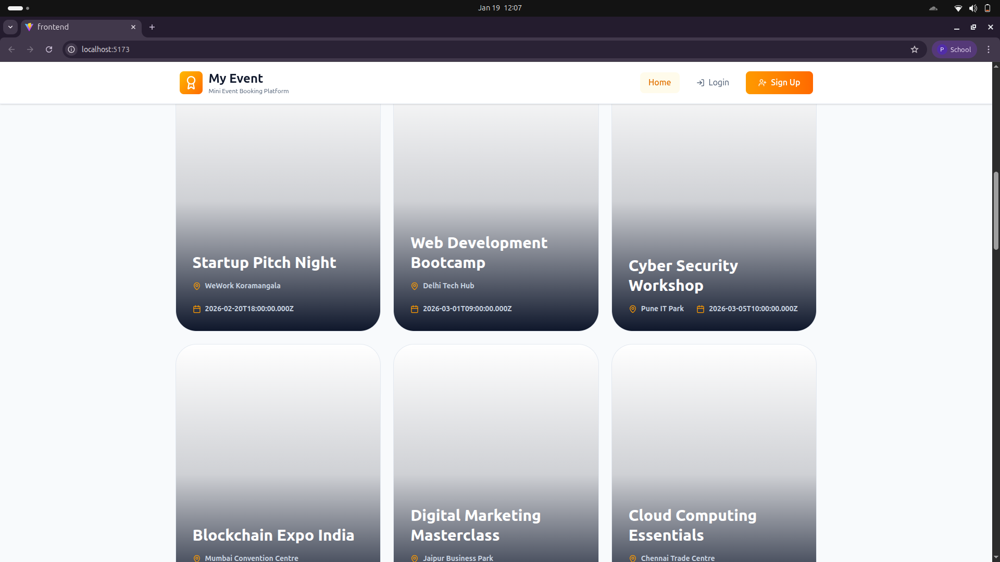
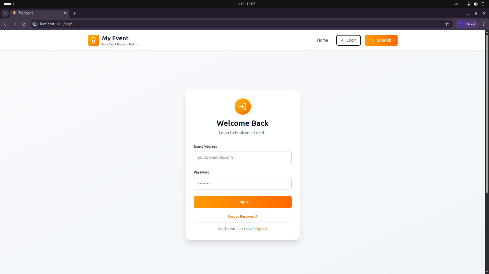
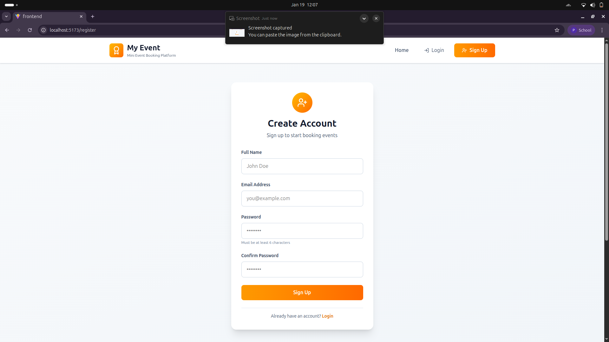
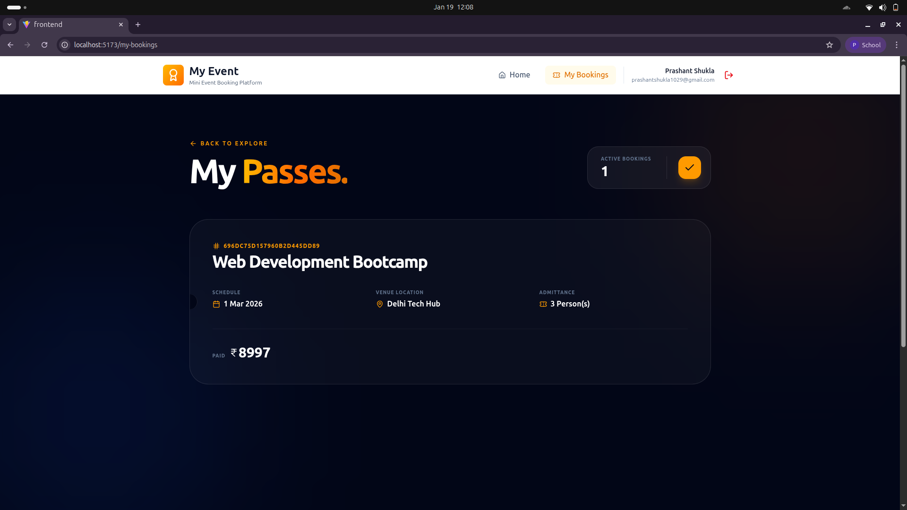

# Event Booking Application

A full-stack event booking platform with user authentication, event listings, and seat reservations. The backend is built with Node.js, Express, and MongoDB, while the frontend uses React + Vite.

## Setup Instructions

### Prerequisites
- Node.js 18+ (LTS recommended)
- MongoDB (local or MongoDB Atlas)

### Install Dependencies
From the project root, install backend and frontend dependencies:

- Backend:
  - `cd backend`
  - `npm install`

- Frontend:
  - `cd frontend`
  - `npm install`

### Environment Variables

#### Backend (backend/.env)
Create a `.env` file in `backend/` using `backend/.env.example` as reference:

```
MONGODB_URI="<your-mongodb-connection-string>"
PORT=5001
JWT_SECRET="<your-jwt-secret>"
```

#### Frontend (frontend/.env)
Ensure `frontend/.env` contains:

```
VITE_API_URL="http://localhost:5001"
```

### Run the Backend Server
From `backend/`:
- `npm start`

The backend will run on the port defined in `.env` (default: 5001).

### Run the Frontend Application
From `frontend/`:
- `npm run dev`

The app will be available at the Vite dev server URL (default: http://localhost:5173).

## API Documentation

Base URL: `http://localhost:5001`

### Auth

#### POST /api/auth/register
Register a new user.

**Request Body**
```json
{
  "name": "John Doe",
  "email": "john@example.com",
  "password": "password123"
}
```

**Response (201)**
```json
{
  "message": "User registered successfully",
  "user": {
    "id": "<userId>",
    "name": "John Doe",
    "email": "john@example.com",
    "createdAt": "<iso-date>"
  }
}
```

#### POST /api/auth/login
Login with email and password.

**Request Body**
```json
{
  "email": "john@example.com",
  "password": "password123"
}
```

**Response (200)**
```json
{
  "message": "Login successful",
  "token": "<jwt-token>",
  "user": {
    "id": "<userId>",
    "name": "John Doe",
    "email": "john@example.com"
  }
}
```

### Events

#### GET /api/events
Get upcoming events.

**Response (200)**
```json
{
  "events": [
    {
      "_id": "<eventId>",
      "title": "Tech Meetup",
      "date": "<iso-date>",
      "venue": "City Hall",
      "price": 100,
      "availableSeats": 50
    }
  ]
}
```

#### GET /api/events/:id
Get a single event by ID.

**Response (200)**
```json
{
  "event": {
    "_id": "<eventId>",
    "title": "Tech Meetup",
    "date": "<iso-date>",
    "venue": "City Hall",
    "price": 100,
    "availableSeats": 50,
    "description": "<optional>"
  }
}
```

### Bookings

> Requires authentication. Add header: `Authorization: Bearer <jwt-token>`

#### POST /api/bookings
Create a booking for an event.

**Request Body**
```json
{
  "eventId": "<eventId>",
  "seatsBooked": 2
}
```

**Response (201)**
```json
{
  "message": "Booking successful",
  "booking": {
    "_id": "<bookingId>",
    "userId": "<userId>",
    "eventId": "<eventId>",
    "seatsBooked": 2,
    "totalAmount": 200,
    "bookingDate": "<iso-date>"
  }
}
```

#### GET /api/bookings/my
Get bookings for the logged-in user.

**Response (200)**
```json
{
  "bookings": [
    {
      "_id": "<bookingId>",
      "eventId": {
        "_id": "<eventId>",
        "title": "Tech Meetup",
        "date": "<iso-date>",
        "venue": "City Hall"
      },
      "seatsBooked": 2,
      "totalAmount": 200,
      "bookingDate": "<iso-date>"
    }
  ]
}
```

## Screenshots

Add screenshots in `frontend/public/screenshots/` and update the paths below:

- Home page with event listings
  - 
- Login/Register pages
  - 
  - 
- Event details with booking form
  - 
- My Bookings page
  - 
